# CustomSRP
A new SRP from scratch

Unity version : 2019.1.0b4

Tested with : 
Win DX11 Gamma

| Scene | Image | Description |
| --- | - | --- |
| `SRP0101_Basic` | 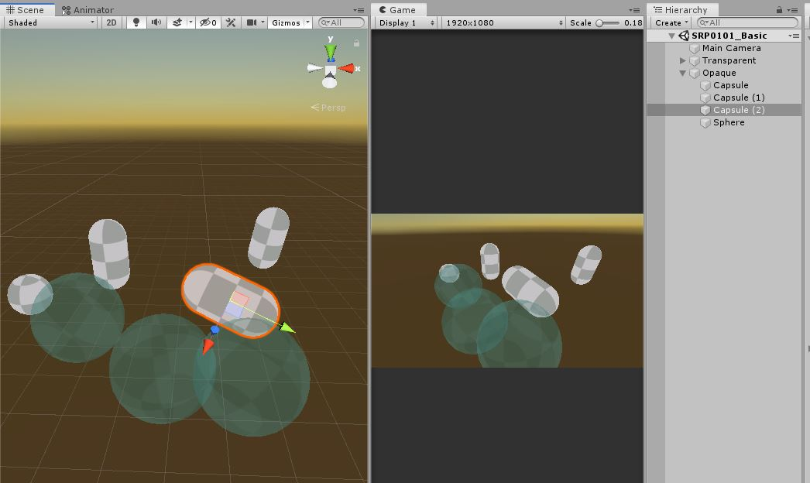 | Super basic SRP that renders unlit material objects |
| `SRP0101_Fog` | 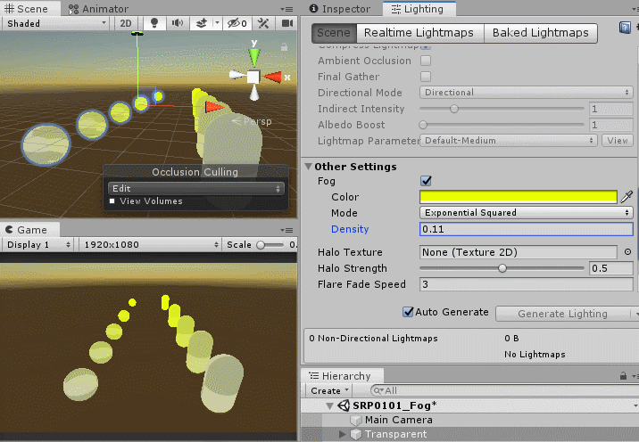 | Use Fog on Lighting Settings |
| `SRP0102_AssetSettings` | 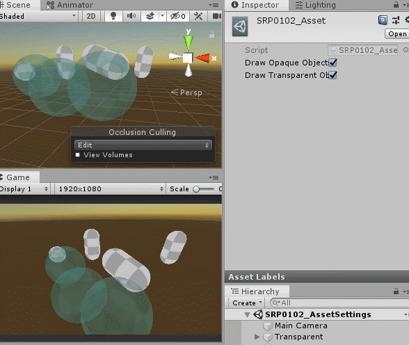 | Let the SRP Asset to pass some custom variables |
| `SRP0103_CustomGUI` | 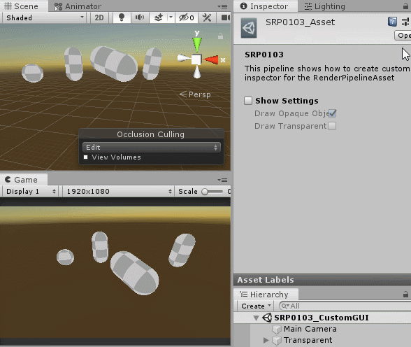 | Have a proper interface for the SRP Asset |
| `SRP0201_FrustumCulling` | 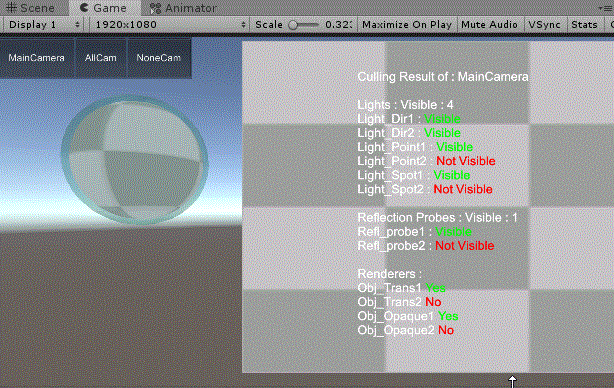 | Frustum culling always work. This is a test scene to verify the culling results |
| `SRP0202_OcclusionCulling` | 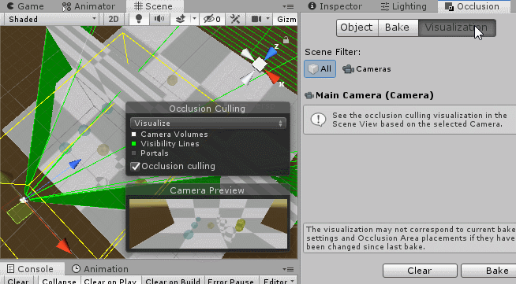 | Baked Occlusion Culling |
| `SRP0301_Batching` | 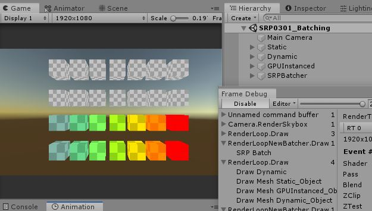 | Use Static Batching, Dynamic Batching, GPU Instancing and SRP Batcher |
| `SRP0401_NoSpecificPass` | 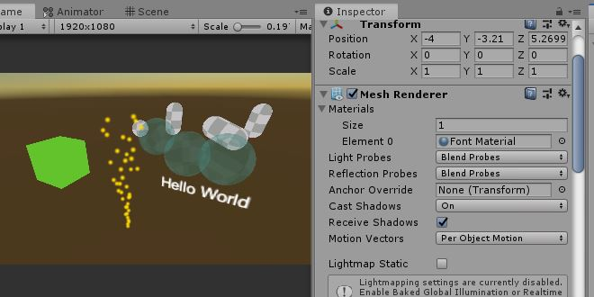 | To draw the shaders that do not have a tag, e.g. default Unlit shaders |
| `SRP0701_HDR_MSAA` |  | Use HDR and MSAA |
| `SRP0702_Postprocessing` | 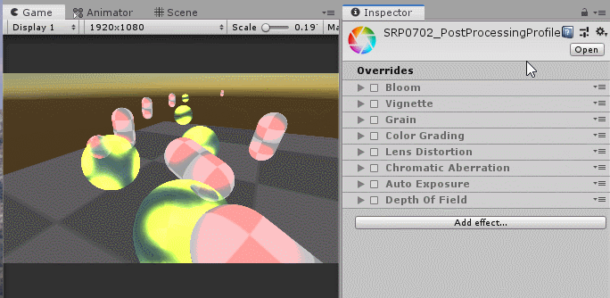 | This shows you how to use Postprocessing Stack with SRP (transparent effects e.g. Bloom, Depth of Field) |
| `SRP0801_UGUI` | 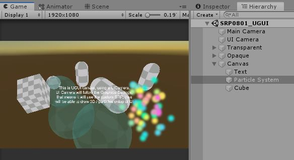 | Use UICamera to render UGUI, also render 3D objects and particle on UI |
| `SRP0901_SceneViewFix` | 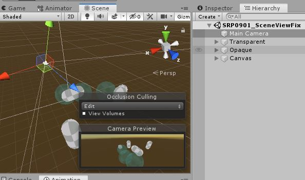 | Make the gizmos / icons appear on scene view |
| `SRP1001_Error` | 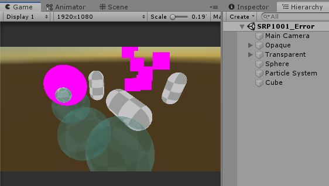 | Render the pink shaders on the materials that the SRP doesn't support |
| `xxxx` |  | xxxxxx |
| `xxxx` |  | xxxxxx |
| `xxxx` |  | xxxxxx |
| `xxxx` |  | xxxxxx |
| `xxxx` |  | xxxxxx |
| `xxxx` |  | xxxxxx |
| `xxxx` |  | xxxxxx |
| `xxxx` |  | xxxxxx |
| `xxxx` |  | xxxxxx |
| `xxxx` |  | xxxxxx |

